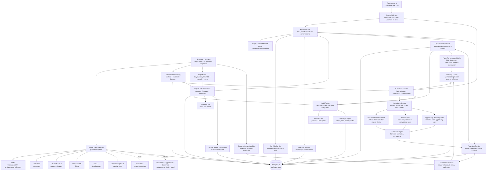
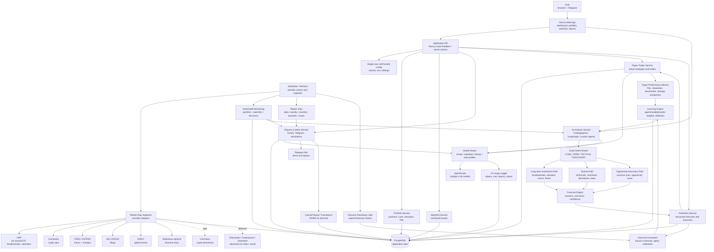

# Application Flow Architecture

This document shows the intended high-level application flow in Russian and English.

## Русская Версия

### Как Работает Поток

1. Пользователь вручную ведет портфель, cash и watchlist в браузерном приложении.
2. Scheduler запускает ingestion только для портфеля, watchlist и настроенного discovery universe.
3. Данные приходят из FMP, CoinGecko, FRED/ALFRED, SEC EDGAR, GDELT и optional Marketaux. CoinGlass добавляется позже для crypto derivatives.
4. AI Analysis Service использует TradingAgents/LangGraph/custom agents и проходит через Asset Intent Router.
5. Forecast Engine сохраняет структурные прогнозы с горизонтом, сценариями, confidence, моделью, агентом и provider provenance.
6. Outcome Evaluation сравнивает прогнозы с фактическими результатами.
7. Learning Engine калибрует веса агентов, моделей, сигналов и провайдеров только на основе измеренных результатов.
8. Paper Trader использует прогнозы для виртуальных сделок и сравнивает стратегии, агентов и модели.
9. Reports & Alerts генерируют отчеты, Telegram-уведомления и on-demand переводы через OpenRouter с кешированием.
10. Реальный портфель никогда не исполняет сделки автоматически.

## English Version

### How The Flow Works

1. The user manually maintains portfolio positions, cash, and watchlist in the web app.
2. The scheduler runs ingestion only for the portfolio, watchlist, and configured discovery universe.
3. Data comes from FMP, CoinGecko, FRED/ALFRED, SEC EDGAR, GDELT, and optional Marketaux. CoinGlass is added later for crypto derivatives.
4. The AI Analysis Service uses TradingAgents/LangGraph/custom agents and passes decisions through the Asset Intent Router.
5. The Forecast Engine stores structured forecasts with horizon, scenarios, confidence, model, agent, and provider provenance.
6. Outcome Evaluation compares forecasts against actual results.
7. The Learning Engine calibrates agent, model, signal, and provider weights only from measured outcomes.
8. Paper Trader uses forecasts for virtual trades and compares strategies, agents, and models.
9. Reports & Alerts generate reports, Telegram notifications, and on-demand translations through OpenRouter with caching.
10. The real portfolio never executes trades automatically.
