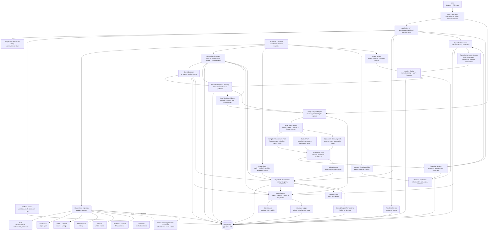

# Application Flow Architecture

This document shows the intended high-level application flow in Russian and English.

## Русская Версия

### Как Работает Поток

1. Пользователь вручную ведет портфель, cash и watchlist в браузерном приложении.
2. Scheduler запускает ingestion только для портфеля, watchlist и настроенного discovery universe.
3. Данные приходят из FMP, CoinGecko, FRED/ALFRED, SEC EDGAR, GDELT и optional Marketaux. CoinGlass добавляется позже для crypto derivatives.
4. Lightweight Scanners и Event Detector дешево находят важные изменения и структурные события.
5. Market Intelligence Memory возвращает исторические аналоги и learned patterns, известные на этот момент.
6. Deep Analysis Engine использует TradingAgents/adapted agents только для приоритетных кандидатов.
7. Forecast Engine сохраняет структурные прогнозы с горизонтом, сценариями, confidence, моделью, агентом и provider provenance.
8. Portfolio Advisor дает советы для реального портфеля, а Paper Trader исполняет только виртуальные сделки.
9. Outcome Evaluation сравнивает прогнозы с фактическими результатами.
10. Learning Engine обновляет market learning, agent learning и internal lessons на основе измеренных результатов.
11. Reports & Alerts генерируют пользовательские отчеты, Telegram-уведомления и on-demand переводы через OpenRouter с кешированием.
12. Реальный портфель никогда не исполняет сделки автоматически.

## English Version

### How The Flow Works

1. The user manually maintains portfolio positions, cash, and watchlist in the web app.
2. The scheduler runs ingestion only for the portfolio, watchlist, and configured discovery universe.
3. Data comes from FMP, CoinGecko, FRED/ALFRED, SEC EDGAR, GDELT, and optional Marketaux. CoinGlass is added later for crypto derivatives.
4. Lightweight Scanners and Event Detector cheaply identify material changes and structured market events.
5. Market Intelligence Memory retrieves historical analogs and learned patterns known at that time.
6. The Deep Analysis Engine uses TradingAgents/adapted agents only for prioritized candidates.
7. The Forecast Engine stores structured forecasts with horizon, scenarios, confidence, model, agent, and provider provenance.
8. Portfolio Advisor provides advisory-only real-portfolio guidance, while Paper Trader executes only virtual trades.
9. Outcome Evaluation compares forecasts against actual results.
10. The Learning Engine updates market learning, agent learning, and internal lessons from measured outcomes.
11. Reports & Alerts generate user-facing reports, Telegram notifications, and on-demand translations through OpenRouter with caching.
12. The real portfolio never executes trades automatically.
